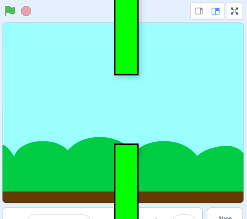

## Add the pipes

First let's create the pipes.

--- task ---

Open a new empty Scratch project.

[[[generic-scratch-new-project]]]

--- /task ---

--- task ---

Add a background with an outdoor landscape. 'blue sky' is a good choice.


[[[generic-scratch-backdrop-from-library]]]

--- /task ---

--- task ---

Click on the `Paint new sprite` button and name your sprite **Pipes**.

[[[generic-scratch-rename-sprite]]]

--- /task ---

The `Pipes` sprite will have a pair of pipes with a gap in the middle. You'll be able to move the sprite up and down to get the gap in a different place.

Let's take a look at how this is going to work.

This picture shows an example of how the pipes could be positioned, the parts outside the stage are normally hidden, you only see it when you drag the sprite:



You can't draw a pipe as big as the pipes need to be, but you can increase the size of a sprite when it's used.

--- task ---

Add code to make the sprite bigger.

```blocks
when green flag clicked
set size to (200) %
```

This will make it easier to see how big you need to make the pipes.

--- /task ---

--- task ---

Switch the Paint editor to Vector mode, by clicking **Convert to vector** in the bottom right.


--- /task ---

--- task ---

Draw a black outline rectangle for the top pipe as shown:


--- /task ---

--- task ---

Fill the rectangle in a colour you like for the pipes.


--- /task ---

--- task ---

Click on the duplicate (stamper) tool and then on your pipe to create a copy.

Drag the copy of the sprite to the bottom of the screen, in line with the top sprite.


--- /task ---
