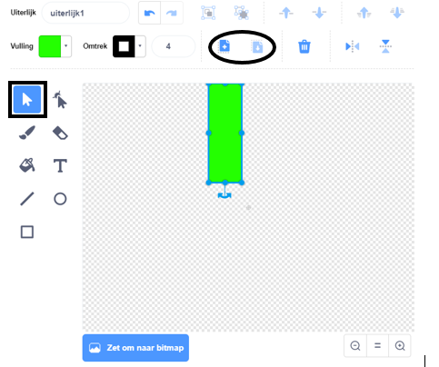

## Voeg de pijpen toe

Maak eerst de pijpen.

--- task ---

Open een nieuw leeg Scratch project.

[[[generic-scratch3-new-project]]]

--- /task ---

--- task ---

Voeg een achtergrond toe met een buitenlandschap. 'Blue Sky' is een goede keuze.


[[[generic-scratch3-backdrop-from-library]]]

--- /task ---

--- task ---

Maak een nieuwe sprite en noem deze 'Pijpen'.

[[[generic-scratch3-draw-sprite]]]

--- /task ---

De sprite 'Pijpen' moet een paar pijpen zijn met een opening in het midden. Door de sprite omhoog of omlaag te bewegen, kun je de opening op een andere plek plaatsen.

Deze afbeelding toont een voorbeeld van hoe de pijpen kunnen worden geplaatst. De delen van de sprite buiten het speelveld zijn normaal verborgen, je ziet ze alleen als je de sprite sleept:


Je kunt een sprite niet net zo groot maken als de pijpen, maar je kunt de grootte vergroten waarmee de sprite in het speelveld wordt weergegeven.

--- task ---


Voeg code toe om de sprite groter te maken.

```blocks3
wanneer op de groene vlag wordt geklikt
maak grootte (200) %
```

Dit maakt het gemakkelijker om te zien hoe groot de pijpen moeten zijn.

--- /task ---

--- task ---

Teken een rechthoek voor de bovenste pijp zoals dit:


--- /task ---

--- task ---

Vul de pijp met een kleur die je leuk vindt.


--- /task ---

--- task ---

Maak een kopie van de pijp door deze te selecteren en vervolgens te klikken op **Kopiëren** en **Plakken**.



--- /task ---

--- task ---

Sleep de kopie van de pijp naar de onderkant van het scherm zodat de kopie in lijn is met de andere pijp. Er moet een opening zijn tussen de twee pijpen.


--- /task ---